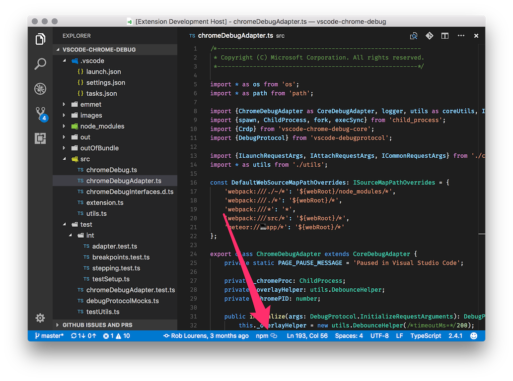
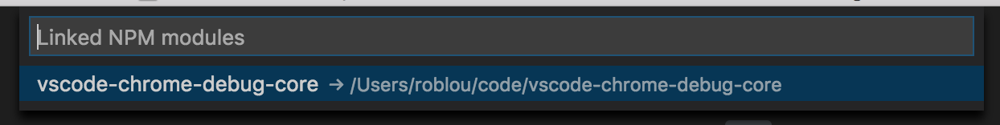

# npm-link-status

[`npm link`](https://docs.npmjs.com/cli/link) is a useful command for working with local versions of npm modules. Unfortunately it's not straightforward to tell when you have linked modules. This extension adds an item to the status bar indicating when it detects linked npm modules.

Click the status bar item to see a list of linked modules, and their actual locations on disk.

